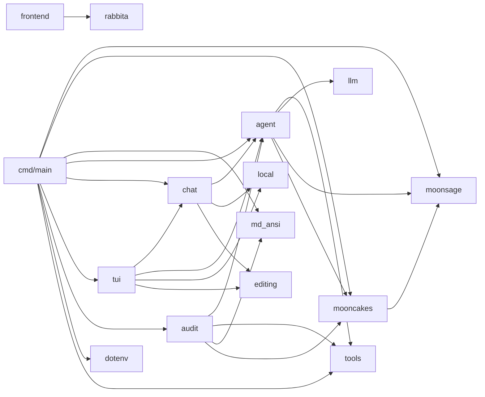

# MoonSage

MoonSage is a MoonBit-native tool-calling agent for discovering packages in the
[Mooncakes](https://mooncakes.io/) registry. It combines deterministic package
search with an optional tool-calling agent that can use OpenAI-compatible,
Anthropic, or Ollama protocols, plan multi-step research, inspect live
manifests, and return cited recommendations.

## Run

```shell
moon run cmd/main -- search "json parser"        # via moon run
moonsage search "json parser"                    # built binary (moon build)
```

`search` does not require an LLM key. To use the agent, configure an API key
and run `ask` for a one-shot question, `chat` for the classic line-oriented
conversation, or `tui` for the enhanced terminal interface:

```powershell
moon run cmd/main -- ask "帮我找一个适合 native 后端的 HTTP 客户端"
moon run cmd/main -- ask --input-file prompt.txt
moon run cmd/main -- chat
moon run cmd/main -- chat --session demo      # resume/create a durable session
moon run cmd/main -- chat --continue          # resume the most recent session
moon run cmd/main -- tui
moon run cmd/main -- tui --session demo       # same durable session store
moon run cmd/main -- tui --continue
```

For headless automation, `ask --stream-json` writes one JSON event per line
and never emits ANSI, Markdown, headers, or trace text. Events include
`thinking_delta`, `tool_started`, `tool_finished`, `retrying`,
`final_started`, `final_delta`, and `error`:

```powershell
moon run cmd/main -- ask --stream-json "find an HTTP client"
```

Tool events include the model round, call ID, tool name, arguments, status,
and result. Network, MCP configuration, retry exhaustion, and agent failures
are emitted as `error` events so JSONL consumers do not need to parse terminal
diagnostics.

`ask` can also load one stdio MCP server from `MOONSAGE_MCP`. Its value is a
JSON object with an explicit executable command; discovered tools are exposed
to the model as `mcp_<server>_<tool>` to avoid collisions with MoonSage's
built-in tools. The server is started in a bounded session for discovery and
for every tool call, then cancelled when the request completes.

```powershell
$env:MOONSAGE_MCP = '{"name":"files","command":"npx","args":["-y","@modelcontextprotocol/server-filesystem","D:/work"]}'
moon run cmd/main -- ask "inspect the project files"
```

Only configure MCP commands you trust: a stdio MCP server is a local process
and has the permissions granted to the MoonSage process.

For independent package investigations, `ask` also gives the model a
read-only `delegate_task` tool. Multiple adjacent delegations run concurrently
(at most three at a time), while their results and lifecycle events are
reported in request order. File, shell, Git, and publishing tools always stay
serial to preserve confirmation and workspace safety.

MoonSage automatically reads `AGENTS.md` and `CLAUDE.md` from the directory
where `ask` or `chat` starts. Both files are appended to the system prompt in
that order and capped at 12,000 bytes each. This lets a repository define its
own build, test, and editing rules without duplicating them in every request.

In `chat` mode the agent can inspect the local project
(`list_project_files`, `read_file`, `run_moon`, `git_diff`) and **modify it**
with `write_file` / `multi_edit` / `remove` — every write asks for your
confirmation (y/N) first, and edited source files must pass `moonc syncheck`.
The agent can also **work on any GitHub repository**: `clone_repo` clones a
repository into `.moonsage/workspaces/` and switches all file tools to it, and
`create_pr` commits the changes, pushes a branch (forking first when needed)
and opens a pull request against the repository (with your confirmation).
Conversations persist under `.moonsage/sessions/` (resumable with `--session`
or `--continue`); very long conversations are compacted automatically by
summarizing older history. `chat` preserves the classic stdin/stdout line
workflow. The separate `tui` frontend adds inline Unicode editing, a slash
command menu, richer status information, and terminal Markdown rendering.

To audit a remote Mooncakes package and (optionally) fix issues it finds:

```powershell
# read-only audit
moon run cmd/main -- audit moonbit-community/cmark

# fix mode: ask before each file change
moon run cmd/main -- audit moonbit-community/cmark --fix --confirm prompt

# fix mode: show the accumulated diff at the end (default)
moon run cmd/main -- audit moonbit-community/cmark --fix --confirm diff

# fix mode: apply without confirmation
moon run cmd/main -- audit moonbit-community/cmark --fix --yes

# fix + push a branch and open a pull request with the changes
moon run cmd/main -- audit moonbit-community/cmark --fix --pr

# remove temporary workspaces left by previous audits
moon run cmd/main -- audit --clean
```

`--pr` requires the GitHub CLI (`gh`) to be authenticated; after the audit
finishes fixing and verifying the clone, MoonSage creates a
`moonsage/fix-<repo>` branch, commits the changes with your GitHub identity,
pushes them (forking the package repository into your account first when you
have no write access), and opens a pull request against the original repo with
the audit report as the PR body. The fix phase uses three write tools:
`write_file` (whole-file writes), `multi_edit` (line-anchored batch edits with
a `moonc syncheck` gate that rejects edits breaking syntax), and `remove`
(delete files); all writes are confined to the cloned workspace.

The audit output also includes structured evidence reconstructed from agent
events. It records every completed tool call and derives verification status
from the actual `run_moon` exit code. In fix mode, a successful verification
must occur after the latest successful edit; conflicting model claims are
reported explicitly.

## Remote audit

The `audit` command audits a remote package by cloning its GitHub repository
into a temporary directory (or the `--workspace <dir>` you provide). It
establishes a `moon build` / `moon test` baseline, then runs a dedicated agent
that lists/reads files, runs moon commands, and - in fix mode - overwrites
files and re-runs tests to verify each fix. It finishes with a Simplified
Chinese report, structured tool evidence, and a `git diff` of every change.

Audit mode is read-only by default; `--fix` enables file writes with a
configurable confirmation mode (`prompt` per-file, `diff` for a final review,
or `yes` to skip). Changes are confined to the cloned workspace and never
touch the user's own files. Fix mode runs in two phases: a read-only
analysis phase (bounded budget) that lists root causes and concrete fixes,
then a fix phase that applies them one at a time with `multi_edit` (or
`write_file` for new files and `remove` for deletion) and
re-runs `moon build` / `moon test` to verify each change before writing the
report. `--max-calls` (default 30) applies to the fix phase. The MoonBit
toolchain (`moon`) and `git` must be available on `PATH`. Each run without
`--workspace` creates a temporary workspace under the system temp directory;
run `audit --clean` to remove all leftover `moonsage-audit-*` workspaces, or
pass `--clean` to an audit run to delete that run's temporary workspace
afterwards (`--clean` and `--workspace` cannot be combined).

### How it works

1. Resolve the package's GitHub repository from its Mooncakes manifest.
2. `git clone --depth 1` into a temporary workspace (or `--workspace <dir>`),
   trying `main` then `master` with retries.
3. Locate the project root (`moon.mod` / `moon.mod.json`, including
   multi-module `moon.work` layouts).
4. Run a dedicated agent (its own budget, default 30 tool calls) with these
   tools: `list_project_files`, `read_file` (with line ranges), `run_moon`
   (build/test inside the workspace), and `git_diff`; `multi_edit`,
   `write_file`, and `remove` appear only in `--fix` mode and are guarded
   against path traversal.
5. The agent establishes a `moon build` / `moon test` baseline, inspects the
   source, and in fix mode rewrites files and re-runs tests to verify each
   change. When the tool budget runs out, the final request exposes no tools
   so the model must answer with a plain-text report.
6. The final report is rendered as ANSI in Simplified Chinese; in fix mode a
   structured evidence section and `git diff` are printed, and `--workspace`
   keeps the tree for inspection.

## Architecture

The module is split into focused sub-packages, each with a single
responsibility and its own tests:

```
moonsage/            domain: models, search, deterministic search agent, response compaction
moonsage/mooncakes   network: fetch modules / manifests / docs from Mooncakes
moonsage/llm         provider adapters, streaming, retries, and delta de-duplication
moonsage/tools       tool contract, registry, and bounded stdio MCP client
moonsage/agent       events, budgets, compaction, delegated research, project instructions
moonsage/chat        classic line chat, durable sessions, and shared agent setup
moonsage/tui         enhanced terminal UI and input event handling
moonsage/frontend    Rabbita web frontend and static host page
moonsage/local       read-only project tools and bounded command execution
moonsage/editing     confirmed edits, syntax gates, repository cloning, and PR tools
moonsage/audit       remote audit: audit tools, source clone, report rendering
moonsage/md_ansi     Markdown -> ANSI terminal renderer
moonsage/dotenv      .env loading
moonsage/cmd/main    thin CLI shell
```

Dependencies point one way only (no cycles):



Both `ask` and `audit` run through the same `@agent.Agent` loop; each command
only supplies its tool set, prompt and budget.

## Configuration

MoonSage reads credentials from the process environment, falling back to a
`.env` file in the project root when the variable is not set. Copy the example
and fill in your own values:

```powershell
Copy-Item .env.example .env
```

`.env` is git-ignored — never commit API keys to source files or `.env`.

| Variable | Required | Default |
| --- | --- | --- |
| `MOONSAGE_API_KEY` | for `chat`, `ask`, and `audit` | — |
| `MOONSAGE_BASE_URL` | no | `https://api.deepseek.com` |
| `MOONSAGE_MODEL` | no | `deepseek-chat` |
| `MOONSAGE_PROVIDER` | no | `openai` |
| `MOONSAGE_MCP` | no | empty |

`MOONSAGE_PROVIDER` accepts `openai`, `anthropic`, or `ollama` and selects the
wire protocol used by `chat`, `ask`, and `audit`. `MOONSAGE_MCP` is a JSON
object for one trusted stdio server and is loaded by `ask`; it accepts `name`,
`command`, optional string-array `args`, and optional positive `timeout_ms`.
The CLI currently requires `MOONSAGE_API_KEY` to be non-empty; use any
non-empty placeholder when connecting to an unauthenticated local Ollama
server.

## Agent loop

The `ask` command runs an observable tool loop with a maximum of six model
rounds, twelve total tool calls, and four package-document reads:

1. Translate the user's intent into package research steps.
2. Call `search_modules` with concise technical keywords.
3. Call `get_module_manifest` for relevant candidates.
4. Call `get_module_index` to discover packages and public symbols.
5. Call `get_package_docs` for API signatures and docstrings.
6. Feed tool observations back to the model.
7. Return an answer in the user's language with Mooncakes documentation URLs.

Mooncakes requests use `moonbitlang/async/http`. The LLM layer streams OpenAI,
Anthropic, or Ollama responses directly, applies connection and idle timeouts,
and retries transient failures. When a retry follows partial output, it must
reproduce the emitted prefix exactly; MoonSage forwards only the new suffix
and rejects divergent responses instead of splicing them together. No
third-party LLM SDK is required, and runtime execution does not depend on curl
or another external program.

## Terminal rendering

The model answers in standard Markdown. When streaming to a terminal, `ask`
renders the Markdown into ANSI styles (bold, headings, inline code, code
blocks, links) using the `moonbit-community/cmark` parser and a small custom
renderer, so raw `**` / `` ` `` markers never reach the screen. Completed
blocks are flushed on blank-line boundaries for a smooth stream, and fenced
code blocks pass through verbatim in reverse video. Output degrades gracefully
to plain text if a chunk cannot be parsed.

## Development

```shell
moon check
moon test
moon info
moon fmt
```
