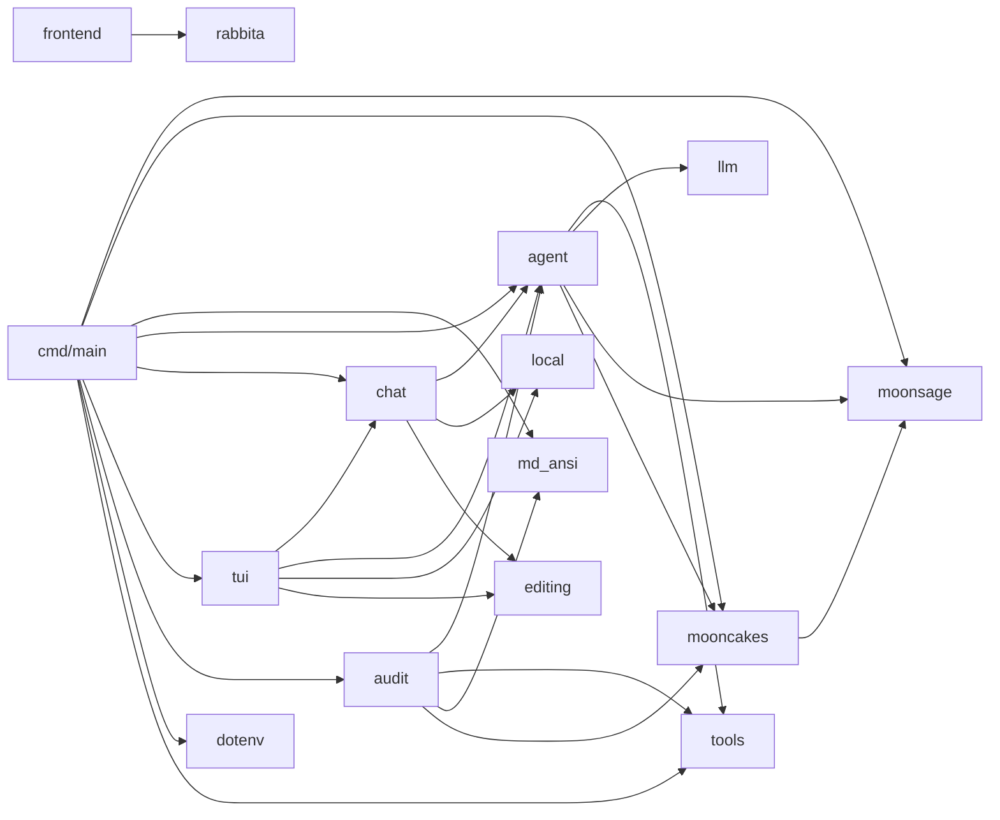

# MoonSage

[](https://github.com/Asterless/MoonSage/actions)
[](https://github.com/Asterless/MoonSage/blob/main/LICENSE)
[](https://github.com/Asterless/MoonSage/releases)
[](https://github.com/Asterless/MoonSage/stargazers)
[](https://www.moonbitlang.com)
[](https://github.com/Asterless/MoonSage/pulls)
[](https://mooncakes.io)

MoonSage is a **MoonBit-native** tool-calling agent for discovering packages in the
[Mooncakes](https://mooncakes.io/) registry. It combines deterministic package
search with an optional LLM agent that supports OpenAI-compatible, Anthropic,
and Ollama protocols — planning multi-step research, inspecting live manifests
and documentation, operating on local projects, and performing remote audits
with automated fix verification.

---

## Features

- **`search`** — Deterministic keyword search across Mooncakes metadata. No LLM key required.
- **`ask`** — One-shot LLM agent with multi-step research, MCP tool support, and parallel sub-agent delegation.
- **`chat`** — Classic line-oriented interactive session with project tools, persistent sessions, and undo support.
- **`tui`** — Enhanced terminal UI with inline editing, slash-command menu, and Markdown ANSI rendering.
- **`frontend`** — Rabbita-based web frontend with session navigation and command menu.
- **`audit`** — Remote package audit: clone source, build/test baseline, inspect with a dedicated agent, and optionally auto-fix with verification.

---

## Quick Start

```powershell
# 1. Clone and enter the project
git clone https://github.com/Asterless/MoonSage.git
cd MoonSage

# 2. Configure API key (copy example and fill in)
Copy-Item .env.example .env
# Edit .env, set MOONSAGE_API_KEY

# 3. Run
moon run cmd/main -- search "json parser"          # Deterministic search (no key needed)
moon run cmd/main -- ask "find an HTTP client"     # LLM agent
moon run cmd/main -- ask --input-file prompt.txt   # Read prompt from UTF-8 file
moon run cmd/main -- chat                           # Interactive agent session
moon run cmd/main -- tui                            # Enhanced terminal UI
moon build frontend --target js --release           # Rabbita web frontend
```

---

## Commands

### `search` — Deterministic Package Search

```shell
moon run cmd/main -- search <keywords>
```

`search` reads the full Mooncakes module metadata, scores candidates by keyword
relevance, and outputs package names, versions, descriptions, licenses, ratings,
and documentation links. No LLM key required.

### `ask` — LLM Agent Q&A

```powershell
moon run cmd/main -- ask "find an HTTP client suitable for native backend"
```

**Agent workflow:** Translate intent → search candidates → inspect manifests →
check module index → read package docs → synthesize a cited answer in the
user's language. Output streams via SSE and renders as ANSI-styled Markdown
(headings, bold, inline code, links, etc.).

For scripting and CI, use JSON Lines output — stdout contains one JSON event
per line, with no ANSI, headers, or trace text mixed in:

```powershell
moon run cmd/main -- ask --stream-json "find an HTTP client"
```

Event types include `thinking_delta`, `tool_started`, `tool_finished`,
`retrying`, `final_started`, `final_delta`, and `error`. Tool events include
the model round, call ID, tool name, arguments, status, and result, enabling
consumers to reconstruct the full execution trace.

`ask` also supports loading one stdio MCP server via `MOONSAGE_MCP`. Discovered
tools are exposed as `mcp_<server>_<tool>` to avoid collision with built-in
tools. The server process is terminated after discovery and after each call:

```powershell
$env:MOONSAGE_MCP = '{"name":"files","command":"npx","args":["-y","@modelcontextprotocol/server-filesystem","D:/work"]}'
moon run cmd/main -- ask "inspect the project files"
```

Only configure MCP commands you trust — the server inherits MoonSage's local
permissions. For independent package research, the agent can also use
read-only `delegate_task` sub-agents (up to 3 concurrent, results returned in
request order).

### `chat` — Resumable Interactive Sessions

```powershell
moon run cmd/main -- chat
moon run cmd/main -- chat --session demo   # Create or resume a named session
moon run cmd/main -- chat --continue       # Resume the most recent session
```

`chat` provides project file search, reading, `moon` command execution, Git
diff, and confirmation-protected write tools. Use `/help` for commands, `/undo`
to revert the last file edit, and `/exit` or `/quit` to leave. Sessions are
stored in `.moonsage/sessions/`; long conversations are compacted automatically
while preserving full recent turns. Both `ask` and `chat` read `AGENTS.md` and
`CLAUDE.md` from the startup directory (capped at 12,000 bytes each) and
append them to the system prompt.

### `tui` — Enhanced Terminal UI

```powershell
moon run cmd/main -- tui
moon run cmd/main -- tui --session demo   # Create or resume a named session
moon run cmd/main -- tui --continue       # Resume the most recent session
```

`tui` shares the same agent, tools, and persistent session store as `chat`, but
offers a fully independent UI: inline Unicode input, character-level editing,
a slash-command menu on `/`, richer status information, and terminal Markdown
rendering.

`frontend` is a browser-based Rabbita interface connecting to the MoonSage
agent via a same-origin `/api/agent` endpoint. Build with
`moon build frontend --target js --release`, then serve with
`node frontend/dev_server.mjs`. The server reuses `MOONSAGE_API_KEY`,
`MOONSAGE_BASE_URL`, `MOONSAGE_MODEL`, and `MOONSAGE_PROVIDER` without
exposing keys to the browser.

### `audit` — Remote Audit & Automated Fix

```powershell
# Read-only audit (default, no code changes)
moon run cmd/main -- audit moonbit-community/cmark

# Fix mode: confirm before each file change
moon run cmd/main -- audit moonbit-community/cmark --fix --confirm prompt

# Fix mode: show accumulated diff at the end (default)
moon run cmd/main -- audit moonbit-community/cmark --fix --confirm diff

# Fix mode: apply without confirmation
moon run cmd/main -- audit moonbit-community/cmark --fix --yes

# Keep workspace for inspection / patch export
moon run cmd/main -- audit moonbit-community/cmark --fix --workspace ./audit-ws

# Fix, verify, push branch, and create a PR
moon run cmd/main -- audit moonbit-community/cmark --fix --pr

# Clean up temporary audit workspaces
moon run cmd/main -- audit --clean
```

**Audit flow:** Parse manifest → `git clone --depth 1` → locate project root →
establish build/test baseline → dedicated agent (default 30 tool calls) inspects
and optionally fixes → output Chinese report, structured evidence, and `git diff`.

Tools available: `list_project_files`, `read_file`, `run_moon`, `git_diff`;
`--fix` mode adds `multi_edit`, `write_file`, `remove` (with path-traversal
protection and three confirmation modes). Existing files prefer `multi_edit`;
all changes stay within the cloned workspace. Verification results after each
edit are recorded based on actual `run_moon` exit codes.

`--pr` requires the GitHub CLI (`gh`) to be authenticated. MoonSage creates a
`moonsage/fix-<repo>` branch, commits, and pushes; forks first when the user
lacks upstream write permissions, then opens a PR against the original repo.

---

## Configuration

MoonSage reads credentials from the process environment, falling back to a
`.env` file in the project root when the variable is not set:

```powershell
Copy-Item .env.example .env
```

`.env` is git-ignored — never commit API keys.

| Variable | Required | Default | Description |
| --- | --- | --- | --- |
| `MOONSAGE_API_KEY` | for `chat`/`ask`/`audit` | — | API key for the selected provider |
| `MOONSAGE_BASE_URL` | no | `https://api.deepseek.com` | API endpoint URL |
| `MOONSAGE_MODEL` | no | `deepseek-chat` | Model name |
| `MOONSAGE_PROVIDER` | no | `openai` | Protocol: `openai`, `anthropic`, or `ollama` |
| `MOONSAGE_MCP` | no | empty | JSON config for one stdio MCP server (used by `ask`) |

`MOONSAGE_PROVIDER` selects the wire protocol for `chat`, `ask`, and `audit`.
`MOONSAGE_MCP` accepts `name`, `command`, optional string-array `args`, and
optional positive `timeout_ms`. The CLI requires `MOONSAGE_API_KEY` to be
non-empty; use any placeholder when connecting to an unauthenticated local
Ollama server.

---

## Architecture

The module is split into focused sub-packages, each with a single responsibility
and its own tests. Dependencies point one way only (no cycles):



| Package | Responsibility |
| --- | --- |
| `moonsage/` | Domain: models, search, deterministic search agent, response compaction |
| `moonsage/mooncakes` | Network: fetch modules / manifests / docs from Mooncakes |
| `moonsage/llm` | Provider adapters, streaming, retries, and delta de-duplication |
| `moonsage/tools` | Tool contract, registry, and bounded stdio MCP client |
| `moonsage/agent` | Events, budgets, compaction, delegated research, project instructions |
| `moonsage/chat` | Classic line chat, durable sessions, and shared agent setup |
| `moonsage/tui` | Enhanced terminal UI and input event handling |
| `moonsage/frontend` | Rabbita web frontend and static host page |
| `moonsage/local` | Read-only project tools and bounded command execution |
| `moonsage/editing` | Confirmed edits, syntax gates, repository cloning, and PR tools |
| `moonsage/audit` | Remote audit: audit tools, source clone, report rendering |
| `moonsage/md_ansi` | Markdown → ANSI terminal renderer |
| `moonsage/dotenv` | `.env` loading |
| `moonsage/cmd/main` | Thin CLI shell |

Both `ask` and `audit` run through the same `@agent.Agent` loop; each command
only supplies its tool set, prompt, and budget.

---

## Agent Loop

The `ask` command runs an observable tool loop (max 6 model rounds, 12 total
tool calls, 4 package-document reads):

1. Translate the user's intent into package research steps.
2. Call `search_modules` with concise technical keywords.
3. Call `get_module_manifest` for relevant candidates.
4. Call `get_module_index` to discover packages and public symbols.
5. Call `get_package_docs` for API signatures and docstrings.
6. Feed tool observations back to the model.
7. Return an answer in the user's language with Mooncakes documentation URLs.

Mooncakes requests use `moonbitlang/async/http`. The LLM layer streams OpenAI,
Anthropic, or Ollama responses directly, applies connection and idle timeouts,
and retries transient failures. When a retry follows partial output, it must
reproduce the emitted prefix exactly; MoonSage forwards only the new suffix and
rejects divergent responses. No third-party LLM SDK is required, and runtime
execution does not depend on curl or other external programs.

---

## Terminal Rendering

Model answers are written in standard Markdown. When streaming to a terminal,
`ask` renders Markdown into ANSI styles (bold, headings, inline code, code
blocks, links) using the `moonbit-community/cmark` parser and a small custom
renderer — raw `**` / `` ` `` markers never reach the screen. Completed blocks
flush on blank-line boundaries for smooth streaming; fenced code blocks pass
through verbatim in reverse video. Output degrades gracefully to plain text on
parse failures.

---

## Development

```shell
moon check   # Static type checking
moon test    # Run tests
moon info    # Update package interface files (.mbti)
moon fmt     # Format code
```

PRs are welcome! Please ensure `moon fmt --check` and `moon info` consistency
pass before submitting.

---

## License

[Apache-2.0](LICENSE) © Asterless
