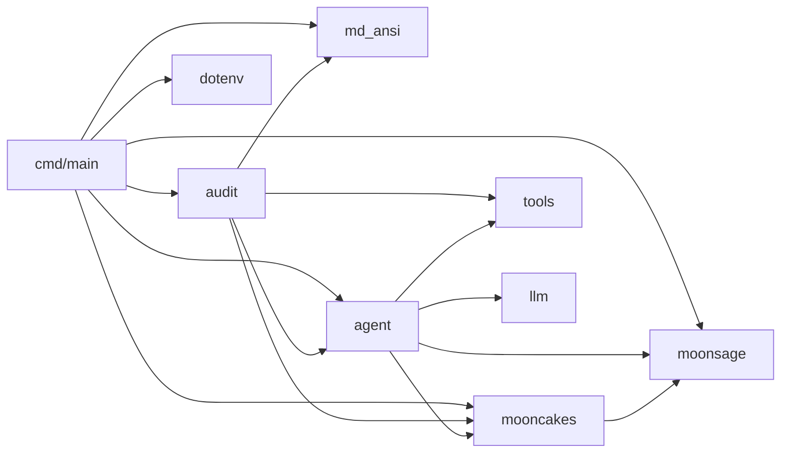

# MoonSage

MoonSage is a MoonBit-native tool-calling agent for discovering packages in the
[Mooncakes](https://mooncakes.io/) registry. It combines deterministic package
search with an optional DeepSeek-powered agent that can plan multi-step
research, inspect live manifests, and return cited recommendations.

## Run

```shell
moon run cmd/main -- search "json parser"
```

`search` does not require an LLM key. To use the agent, configure an API key
and run `ask`:

```powershell
moon run cmd/main -- ask "帮我找一个适合 native 后端的 HTTP 客户端"
```

To audit a remote Mooncakes package and (optionally) fix issues it finds:

```powershell
# read-only audit
moon run cmd/main -- audit moonbit-community/cmark

# fix mode: ask before each file change
moon run cmd/main -- audit moonbit-community/cmark --fix --confirm prompt

# fix mode: show the accumulated diff at the end (default)
moon run cmd/main -- audit moonbit-community/cmark --fix --confirm diff

# fix mode: apply without confirmation
moon run cmd/main -- audit moonbit-community/cmark --fix --yes

# remove temporary workspaces left by previous audits
moon run cmd/main -- audit --clean
```

## Remote audit

The `audit` command audits a remote package by cloning its GitHub repository
into a temporary directory (or the `--workspace <dir>` you provide). It
establishes a `moon build` / `moon test` baseline, then runs a dedicated agent
that lists/reads files, runs moon commands, and - in fix mode - overwrites
files and re-runs tests to verify each fix. It finishes with a report in the
user's language plus a `git diff` of every change.

Audit mode is read-only by default; `--fix` enables file writes with a
configurable confirmation mode (`prompt` per-file, `diff` for a final review,
or `yes` to skip). Changes are confined to the cloned workspace and never
touch the user's own files. Fix mode runs in two phases: a read-only
analysis phase (bounded budget) that lists root causes and concrete fixes,
then a fix phase that applies them one at a time with `write_file` and
re-runs `moon build` / `moon test` to verify each change before writing the
report. `--max-calls` (default 30) applies to the fix phase. The MoonBit
toolchain (`moon`) and `git` must be available on `PATH`. Each run without
`--workspace` creates a temporary workspace under the system temp directory;
run `audit --clean` to remove all leftover `moonsage-audit-*` workspaces, or
pass `--clean` to an audit run to delete that run's temporary workspace
afterwards (`--clean` and `--workspace` cannot be combined).

### How it works

1. Resolve the package's GitHub repository from its Mooncakes manifest.
2. `git clone --depth 1` into a temporary workspace (or `--workspace <dir>`),
   trying `main` then `master` with retries.
3. Locate the project root (`moon.mod` / `moon.mod.json`, including
   multi-module `moon.work` layouts).
4. Run a dedicated agent (its own budget, default 30 tool calls) with these
   tools: `list_project_files`, `read_file` (with line ranges), `run_moon`
   (build/test inside the workspace), `git_diff`; `write_file` appears only
   in `--fix` mode and is guarded against path traversal.
5. The agent establishes a `moon build` / `moon test` baseline, inspects the
   source, and in fix mode rewrites files and re-runs tests to verify each
   change. When the tool budget runs out, the final request exposes no tools
   so the model must answer with a plain-text report.
6. The final report is rendered as ANSI in the user's language; in fix mode a
   `git diff` of every change is printed, and `--workspace` keeps the tree
   for inspection.

## Architecture

The module is split into focused sub-packages, each with a single
responsibility and its own tests:

```
moonsage/            domain: models, search, deterministic search agent, response compaction
moonsage/mooncakes   network: fetch modules / manifests / docs from Mooncakes
moonsage/llm         LLM streaming protocol (SSE + stream_chat_completion)
moonsage/tools       tool contract (ToolSchema / Tool / registry), zero project deps
moonsage/agent       generic LLM agent runtime (loop + budgets + plain-text final answer)
moonsage/audit       remote audit: audit tools, source clone, report rendering
moonsage/md_ansi     Markdown -> ANSI terminal renderer
moonsage/dotenv      .env loading
moonsage/cmd/main    thin CLI shell
```

Dependencies point one way only (no cycles):



Both `ask` and `audit` run through the same `@agent.Agent` loop; each command
only supplies its tool set, prompt and budget.

## Configuration

MoonSage reads credentials from the process environment, falling back to a
`.env` file in the project root when the variable is not set. Copy the example
and fill in your own values:

```powershell
Copy-Item .env.example .env
```

`.env` is git-ignored — never commit API keys to source files or `.env`.

| Variable | Required | Default |
| --- | --- | --- |
| `MOONSAGE_API_KEY` | for `ask` | — |
| `MOONSAGE_BASE_URL` | no | `https://api.deepseek.com` |
| `MOONSAGE_MODEL` | no | `deepseek-chat` |

## Agent loop

The `ask` command runs an observable tool loop with a maximum of six model
rounds, twelve total tool calls, and four package-document reads:

1. Translate the user's intent into package research steps.
2. Call `search_modules` with concise technical keywords.
3. Call `get_module_manifest` for relevant candidates.
4. Call `get_module_index` to discover packages and public symbols.
5. Call `get_package_docs` for API signatures and docstrings.
6. Feed tool observations back to the model.
7. Return an answer in the user's language with Mooncakes documentation URLs.

Mooncakes requests use `moonbitlang/async/http`. The `ask` command streams
chat completions directly from any OpenAI-compatible API (e.g. DeepSeek) over
SSE (`text/event-stream`): it reads the response body incrementally, parses
each `data:` delta, and assembles text and tool calls as they arrive. No
third-party LLM SDK is required, and runtime execution does not depend on curl
or another external program.

## Terminal rendering

The model answers in standard Markdown. When streaming to a terminal, `ask`
renders the Markdown into ANSI styles (bold, headings, inline code, code
blocks, links) using the `moonbit-community/cmark` parser and a small custom
renderer, so raw `**` / `` ` `` markers never reach the screen. Completed
blocks are flushed on blank-line boundaries for a smooth stream, and fenced
code blocks pass through verbatim in reverse video. Output degrades gracefully
to plain text if a chunk cannot be parsed.

## Development

```shell
moon check
moon test
moon info
moon fmt
```
