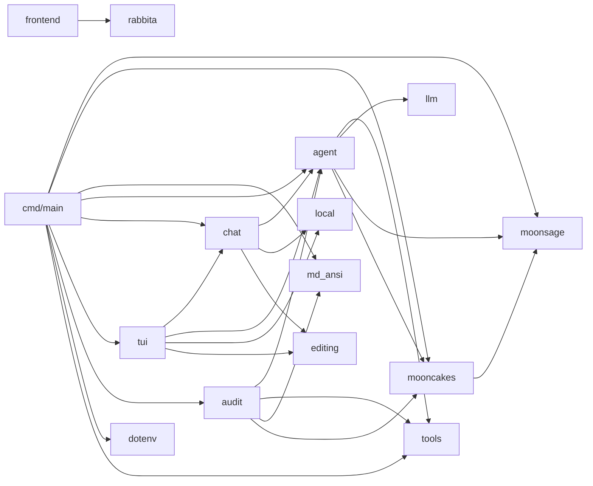

# MoonSage

[](https://github.com/Asterless/MoonSage/actions)
[](https://github.com/Asterless/MoonSage/blob/main/LICENSE)
[](https://github.com/Asterless/MoonSage/releases)
[](https://github.com/Asterless/MoonSage/stargazers)
[](https://www.moonbitlang.com)
[](https://github.com/Asterless/MoonSage/pulls)
[](https://mooncakes.io)

MoonSage 是一个面向 [Mooncakes](https://mooncakes.io/)（MoonBit 包生态）的 **MoonBit 原生**智能体工具。它结合了确定性的包搜索与可选的 LLM Agent，支持 OpenAI 兼容、Anthropic 与 Ollama 协议，能够规划多步研究、查阅实时 manifest 与文档、操作本地项目，并对远程包进行审计和自动化修复验证。

---

## 功能一览

- **`search`** — 确定性包搜索，无需 LLM Key，对 Mooncakes 全量元数据做关键词匹配与排序。
- **`ask`** — 单次 Agent 问答，支持多步研究、MCP 工具与并行子代理委派。
- **`chat`** — 经典行输入交互会话，保留标准终端输入输出行为，支持会话恢复、文件编辑与撤销。
- **`tui`** — 独立的增强终端界面，提供内联编辑、斜杠命令菜单、状态信息与 Markdown ANSI 渲染。
- **`frontend`** — 基于 Rabbita 的简洁 Web 前端，提供会话导航、消息流与命令菜单。
- **`audit`** — 远程审计：克隆源码、建立构建/测试基线、专用 Agent 检查代码，`--fix` 模式下可自动修复并重跑验证。

---

## 快速开始

```powershell
# 1. 克隆并进入项目
git clone https://github.com/Asterless/MoonSage.git
cd MoonSage

# 2. 配置 API Key（复制示例并填写）
Copy-Item .env.example .env
# 编辑 .env，填入 MOONSAGE_API_KEY

# 3. 运行
moon run cmd/main -- search "json parser"          # 确定性搜索（无需 Key）
moon run cmd/main -- ask "帮我找一个 HTTP 客户端"   # LLM Agent
moon run cmd/main -- ask --input-file prompt.txt    # 从 UTF-8 文件读取问题
moon run cmd/main -- chat                           # 交互式本地 Agent
moon run cmd/main -- tui                            # 增强终端界面
moon build frontend --target js --release           # Rabbita Web 前端
```

---

## 命令详解

### `search` — 确定性包搜索

```shell
moon run cmd/main -- search <关键词>
```

`search` 读取 Mooncakes 全量模块元数据，按关键词打分排序，输出包名、版本、描述、许可证、评分与文档链接。不需要 LLM Key。

### `ask` — LLM Agent 问答

```powershell
moon run cmd/main -- ask "帮我找一个适合 native 后端的 HTTP 客户端"
```

**Agent 工作流：** 翻译意图 → 搜索候选 → 查 manifest → 查 module index → 查 package docs → 汇总带引用的中文结论。输出通过 SSE 流式到达，并在终端渲染成 ANSI 样式（标题、粗体、行内代码、链接等）。

用于脚本和 CI 时，可启用 JSON Lines 输出。该模式的标准输出只包含一行一个 JSON 事件，不混入 ANSI、标题或 trace 文本：

```powershell
moon run cmd/main -- ask --stream-json "find an HTTP client"
```

事件类型包括 `thinking_delta`、`tool_started`、`tool_finished`、`retrying`、`final_started`、`final_delta` 与 `error`。工具事件包含回合号、调用 ID、名称、参数、状态和结果，便于调用方重建完整执行过程。

`ask` 还支持通过 `MOONSAGE_MCP` 接入一个显式的 stdio MCP 服务。发现的工具会以 `mcp_<server>_<tool>` 命名，并在每次发现或调用结束后终止服务进程：

```powershell
$env:MOONSAGE_MCP = '{"name":"files","command":"npx","args":["-y","@modelcontextprotocol/server-filesystem","D:/work"]}'
moon run cmd/main -- ask "检查项目文件"
```

只应配置可信的 MCP 命令，因为服务进程继承 MoonSage 的本地权限。对于彼此独立的包研究，Agent 也可使用只读的 `delegate_task` 子代理，最多并发执行 3 个相邻委派，并按请求顺序返回结果。

### `chat` — 可恢复的交互会话

```powershell
moon run cmd/main -- chat
moon run cmd/main -- chat --session demo   # 创建或恢复指定会话
moon run cmd/main -- chat --continue       # 恢复最近会话
```

`chat` 提供项目文件搜索、读取、`moon` 命令执行、Git diff 和受确认保护的写入工具。使用 `/help` 查看命令，`/undo` 撤销最近一次文件编辑，`/exit` 或 `/quit` 离开会话。会话保存在 `.moonsage/sessions/`，长会话会在保留完整最近轮次的前提下自动压缩。`ask` 与 `chat` 都会读取启动目录下的 `AGENTS.md` 和 `CLAUDE.md`，按此顺序加入系统提示，每个文件最多读取 12,000 字节。

### `tui` — 增强终端界面

```powershell
moon run cmd/main -- tui
moon run cmd/main -- tui --session demo   # 创建或恢复指定会话
moon run cmd/main -- tui --continue       # 恢复最近会话
```

`tui` 与 `chat` 共用 Agent、工具与持久会话，但界面实现完全独立：中文内联输入、字符级编辑、输入 `/` 后的命令菜单、更多状态信息及 Markdown 终端渲染。

`frontend` 是浏览器端 Rabbita 界面，通过同源 `/api/agent` 端点连接 MoonSage Agent。运行 `moon build frontend --target js --release` 后使用 `node frontend/dev_server.mjs` 启动；服务端沿用 `MOONSAGE_API_KEY`、`MOONSAGE_BASE_URL`、`MOONSAGE_MODEL` 与 `MOONSAGE_PROVIDER`，不会把密钥暴露到浏览器。

### `audit` — 远程审计与自动修复

```powershell
# 只读审计（默认，不改代码）
moon run cmd/main -- audit moonbit-community/cmark

# 修复模式：写每个文件前逐条确认
moon run cmd/main -- audit moonbit-community/cmark --fix --confirm prompt

# 修复模式：最后统一展示 diff（默认）
moon run cmd/main -- audit moonbit-community/cmark --fix --confirm diff

# 修复模式：跳过确认直接改
moon run cmd/main -- audit moonbit-community/cmark --fix --yes

# 保留工作区便于查看 / 导出补丁
moon run cmd/main -- audit moonbit-community/cmark --fix --workspace ./audit-ws

# 修复、验证、推送分支并创建 PR
moon run cmd/main -- audit moonbit-community/cmark --fix --pr

# 清理之前遗留的临时审计工作区
moon run cmd/main -- audit --clean
```

**审计流程：** 解析 manifest → `git clone --depth 1` 源码 → 定位项目根 → 建立构建和测试基线 → 专用 Agent（独立预算，默认 30 次工具调用）检查/修复 → 输出中文报告、结构化工具证据与 `git diff`。工具包括 `list_project_files`、`read_file`、`run_moon`、`git_diff`，`--fix` 时追加 `multi_edit`、`write_file`、`remove`（带路径穿越防护与三种确认模式）。已有文件优先使用局部 `multi_edit`，改动只发生在克隆的工作区内；每次成功编辑后的验证结果会根据实际 `run_moon` 退出码记录。

`--pr` 需要已登录的 GitHub CLI。MoonSage 会创建 `moonsage/fix-<repo>` 分支、提交并推送修复；没有上游写权限时先 fork，再向原仓库创建 PR。

---

## 配置

配置读取自进程环境变量，未设置时回退到项目根目录的 `.env` 文件：

```powershell
Copy-Item .env.example .env
```

`.env` 已被 git 忽略，不要把 Key 提交到仓库。

| 变量 | 必填 | 默认值 | 说明 |
| --- | --- | --- | --- |
| `MOONSAGE_API_KEY` | chat/ask/audit 需要 | — | 所选 provider 的 API Key |
| `MOONSAGE_BASE_URL` | 否 | `https://api.deepseek.com` | API 端点 |
| `MOONSAGE_MODEL` | 否 | `deepseek-chat` | 模型名 |
| `MOONSAGE_PROVIDER` | 否 | `openai` | 协议：`openai`、`anthropic` 或 `ollama` |
| `MOONSAGE_MCP` | 否 | 空 | 单个 stdio MCP 服务的 JSON 配置，仅 `ask` 使用 |

当前 CLI 要求 `MOONSAGE_API_KEY` 为非空字符串；连接无需认证的本地 Ollama 时可设置任意非空占位值。

---

## 项目结构

MoonSage 拆分为职责单一的多个子包，依赖单向无环：



| 包 | 职责 |
| --- | --- |
| `moonsage/` | 领域层：数据模型、搜索、确定性搜索 Agent、响应压缩 |
| `moonsage/mooncakes` | 网络层：拉取 modules / manifest / docs |
| `moonsage/llm` | 多 provider LLM 流式协议、SSE 解析、重试与增量去重 |
| `moonsage/tools` | 工具契约、注册表与 stdio MCP 客户端 |
| `moonsage/agent` | 通用 Agent 运行时：事件、预算、压缩、子代理、项目指令 |
| `moonsage/chat` | 经典行输入会话、持久化与共享 Agent 配置 |
| `moonsage/tui` | 独立增强终端界面与输入事件处理 |
| `moonsage/frontend` | Rabbita Web 前端与静态页面 |
| `moonsage/local` | 本地项目只读工具与命令执行 |
| `moonsage/editing` | 受确认和语法检查保护的编辑、克隆与 PR 工具 |
| `moonsage/audit` | 远程审计：审计工具、源码克隆、报告渲染 |
| `moonsage/md_ansi` | Markdown → ANSI 终端渲染 |
| `moonsage/dotenv` | `.env` 加载 |
| `moonsage/cmd/main` | 应用壳：CLI 分发 |

`ask` 与 `audit` 共用同一个 `@agent.Agent` 循环，各自只提供工具集、提示词与预算。

---

## Agent 循环

`ask` 命令运行一个可观测的工具循环（最多 6 轮模型交互、12 次工具调用、4 次包文档读取）：

1. 将用户意图翻译为包研究步骤。
2. 调用 `search_modules` 使用简洁的技术关键词搜索。
3. 调用 `get_module_manifest` 获取候选包的 manifest。
4. 调用 `get_module_index` 发现包和公开符号。
5. 调用 `get_package_docs` 获取 API 签名和文档字符串。
6. 将工具观测结果反馈给模型。
7. 以用户所用的语言返回带 Mooncakes 文档链接的结论。

Mooncakes 请求使用 `moonbitlang/async/http`。LLM 层直接流式传输 OpenAI、Anthropic 或 Ollama 响应，应用连接超时和空闲超时，并重试瞬时故障。重试时若先前已有部分输出，必须精确重现已发出的前缀；MoonSage 仅转发新的后缀部分，并拒绝不一致的响应。无需第三方 LLM SDK，运行时也不依赖 curl 或其他外部程序。

---

## 终端渲染

模型回答采用标准 Markdown。流式输出到终端时，`ask` 使用 `moonbit-community/cmark` 解析器和自定义渲染器将 Markdown 转换为 ANSI 样式（粗体、标题、行内代码、代码块、链接），原始 `**` / `` ` `` 标记不会直接显示到屏幕。完成块在空行边界刷新以保持流畅，围栏代码块以反白视频方式原样输出。解析失败时降级为纯文本。

---

## 开发

```shell
moon check   # 静态类型检查
moon test    # 运行测试
moon info    # 更新包接口文件 (.mbti)
moon fmt     # 格式化代码
```

欢迎提交 PR！请确保提交前通过 `moon fmt --check` 和 `moon info` 一致性检查。

---

## 许可证

[Apache-2.0](LICENSE) © Asterless
